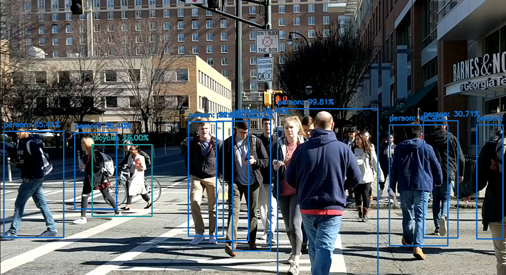
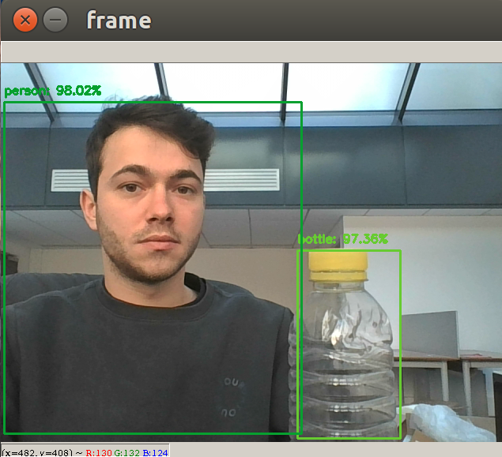

# Real-time-object-detection
Real-time object detection based on caffe pre-trained model

## Dependencies

* OpenCv
* imutils

```
pip install -r requirements.txt
```

## Docker


```
docker build -t object_detection .
```


Run the project with pre-trained model :

```
bash RunDocker.sh
```

## Result 
<p float="left">
  
  
</p>  

* Achieve 19 FPS with 640x480 resolution

## Reference

 The model is a caffe implementation of MobileNet-SSD detection network trained by 
 <a href = "https://github.com/chuanqi305/MobileNet-SSD"> chuanqi305</a>


